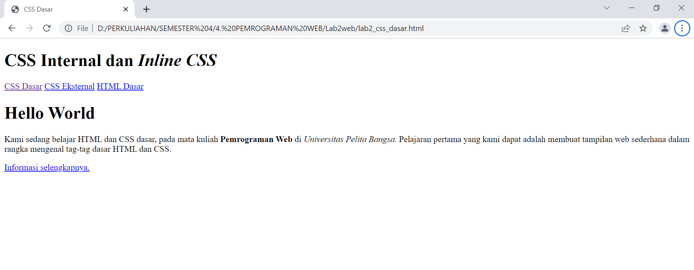
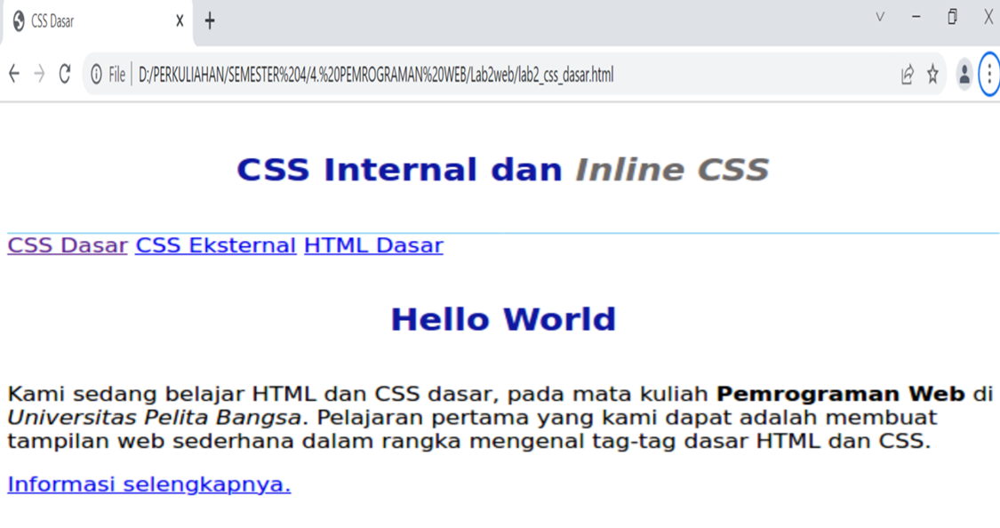
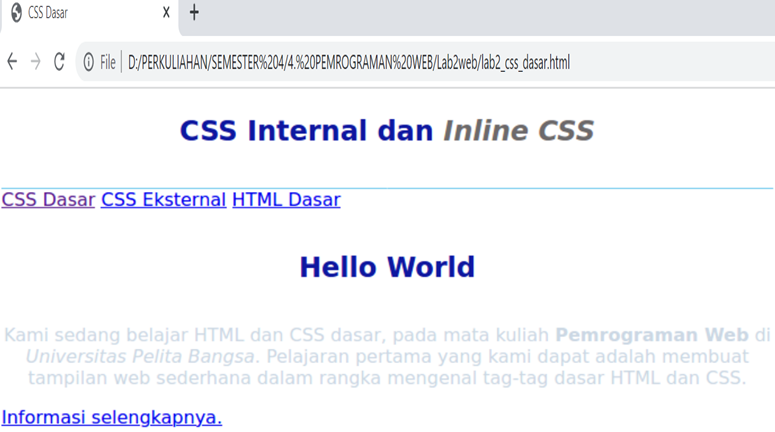
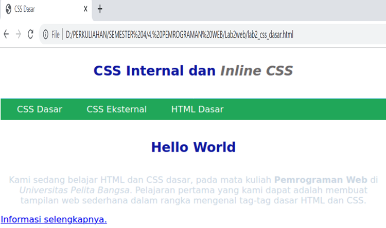
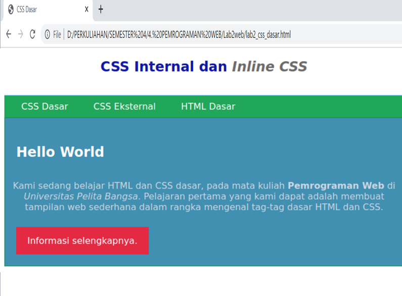

# Lab2web
## Tugas Pemrograman web - Pertemuan Ke 3

Nama    : Rudi Hartono

NIM     : 312010027

Kelas   : TI.20.B1

*Pada pertemuan ke 3 matakuliah pemrograman web, saya akan melakukan beberapa perintah pada HTML*

- Menampilkan Title HTML pada browser  

 

1. **Membuat dokumen HTML**
 
Pada poin pertama ini kita akan membuat dokumen HTML pada file HTML kita.
Pada sintax ini bertujuan untuk membuat dokumen HTML. Seperti contoh pada gambar berikut:

2. **Mendeklarasikan CSS Internal**
 
kemudian pada poin ke-dua ini kita akan tambahkan deklarasi CSS Internal.
seperti contoh pada gambar berikut:

3. **Menambahkan inline CSS**
 
kemudian pada poin ke-tiga ini kita akan menambahkan inline CSS.
seperti pada contoh gambar berikut:

4. **Membuat CSS External**
 
Lalu pada point ini kita akan membuat CSS External pada file HTML.
Berikut adalah contoh gambar nya:

5. **Menambahkan CSS Selector**
 
lalu pada poin terakhir ini kita akan menambahkan CSS Selector pada file HTML kita.
seperti contoh pada gambar di bawah ini:

